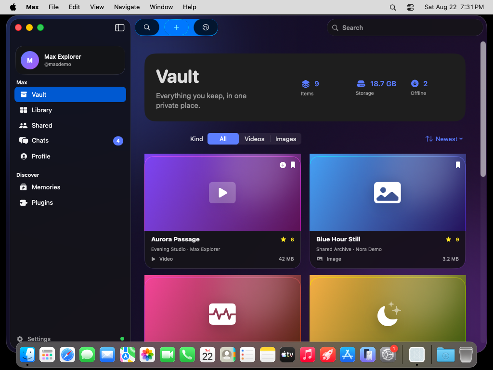

# Max — iPhone and macOS 26

Public Swift source mirror for Max. The iPhone client lives in `apps/ios`; the
native Tahoe client lives in `apps/macos` and carries the same root feature set
into a Mac-first `NavigationSplitView` layout.

## Native macOS 26 client

The Mac target is Swift 6 + SwiftUI with a macOS 26 deployment target. Its
surfaces use Tahoe's native Liquid Glass APIs (`glassEffect`,
`GlassEffectContainer`, `.glass`, and `.glassProminent`) rather than a custom
blur imitation.

Feature coverage includes authentication, Vault and media playback, dual
ratings, uploads and transfers, every Library section, shared files and spaces,
chats, profile editing, memories, plugins, settings, six themes, English/Arabic
RTL, and compact-window layouts.

Generate the Xcode project on a Mac with Xcode 26:

```bash
cd apps/macos
xcodegen generate
open MaxMac.xcodeproj
```

## Verified CI build

The final workflow ran on a real GitHub-hosted `macos-26` runner (macOS 26.5.2,
arm64, Xcode 26.6, Swift 6.3.3). It built the Release app, passed 5 unit tests and
3 UI gallery tests, captured 36 PNG screenshots from the running app, and
uploaded the app zip, SHA-256, build/test logs, and `.xcresult` bundle.

- [Successful GitHub Actions run](https://github.com/justpainful/Maxishere2.0/actions/runs/32593863848)
- [Complete macOS 26 screenshot gallery](docs/screenshots/macos-26/README.md)
- [macOS source](apps/macos)
- [CI workflow](.github/workflows/macos-26-liquid-glass.yml)



The application artifact is intentionally delivered through GitHub Actions;
the public branch keeps source and CI-produced visual evidence, not a committed
application binary. All rights reserved.
