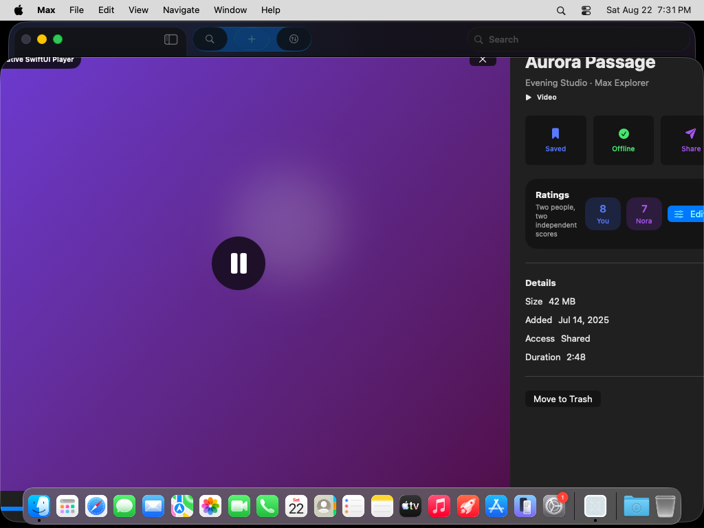
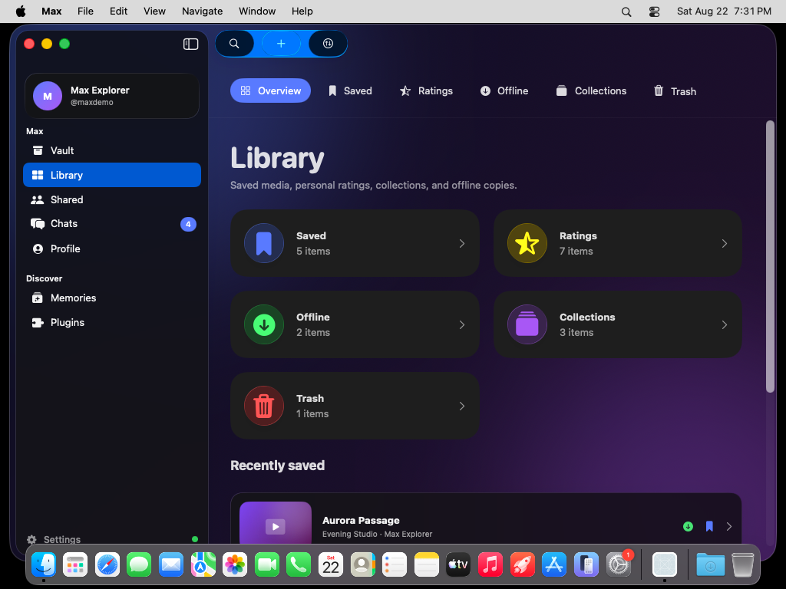
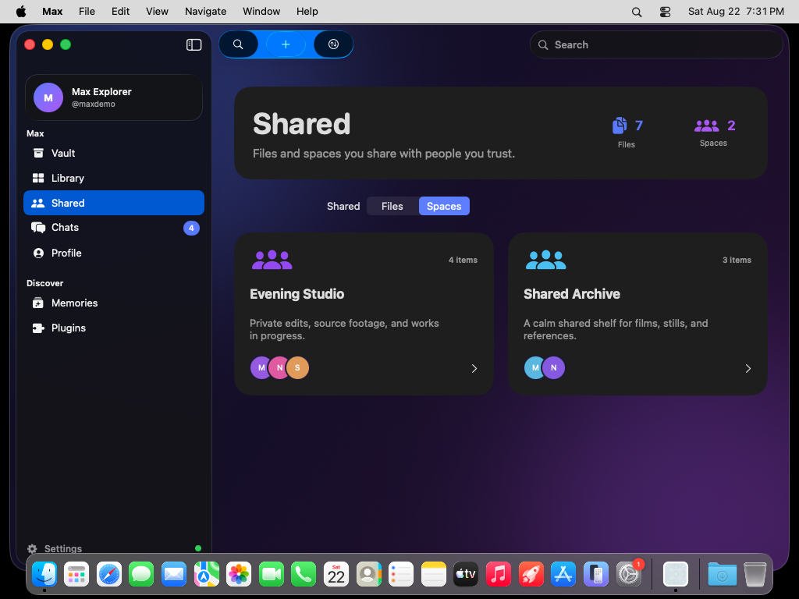
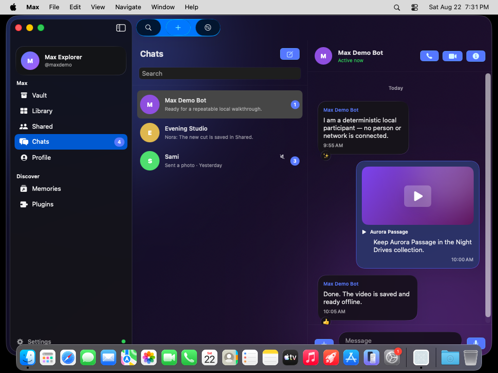
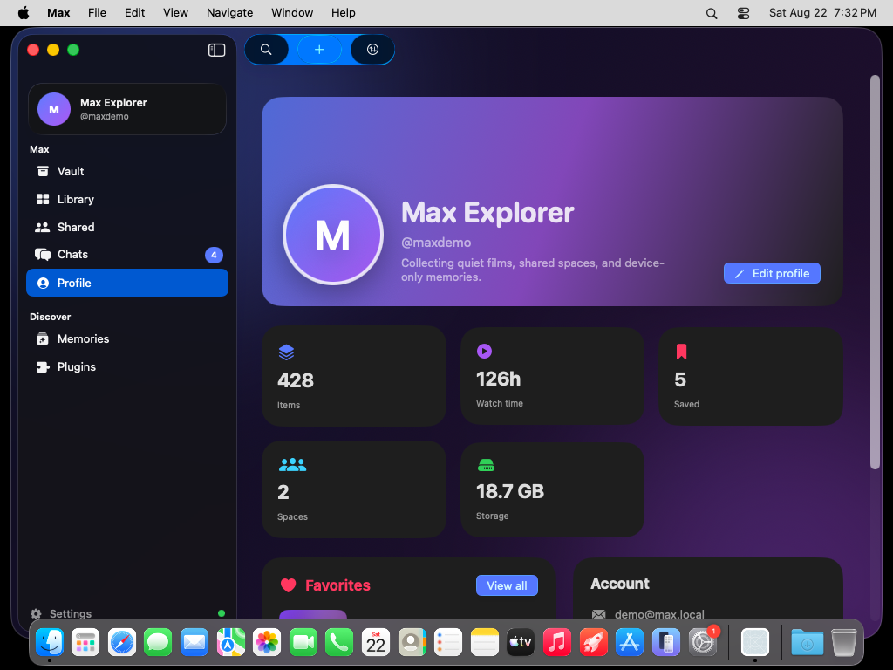
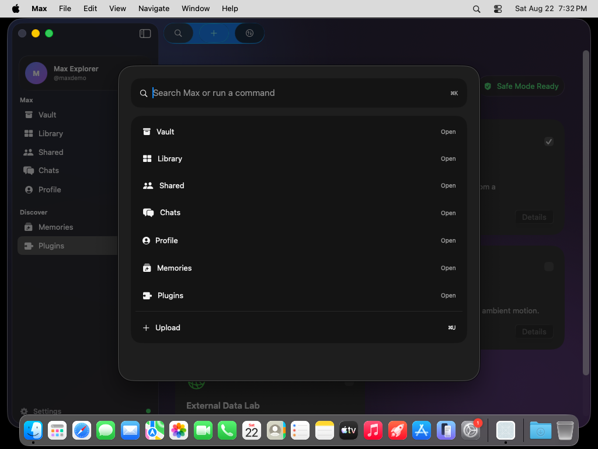
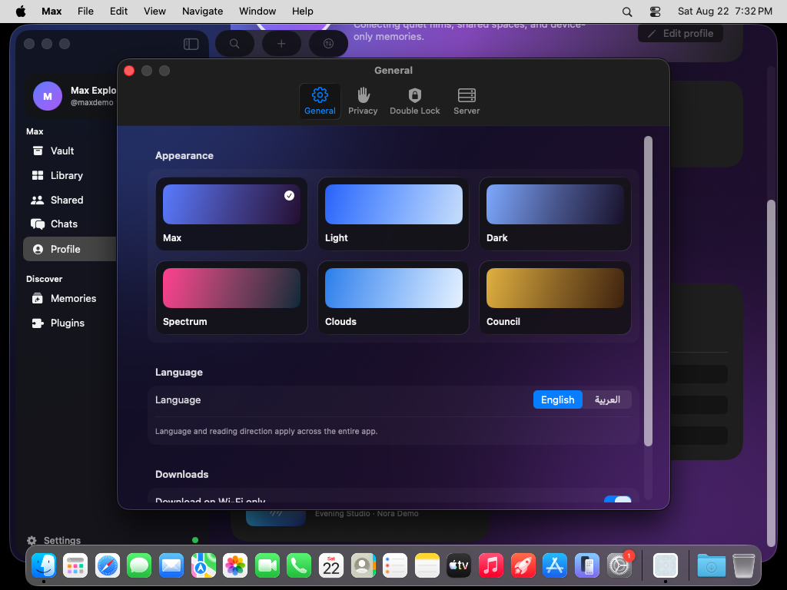
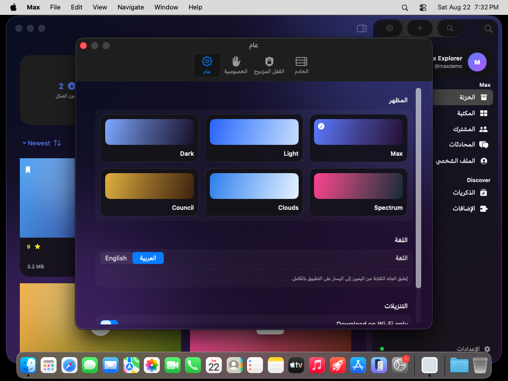
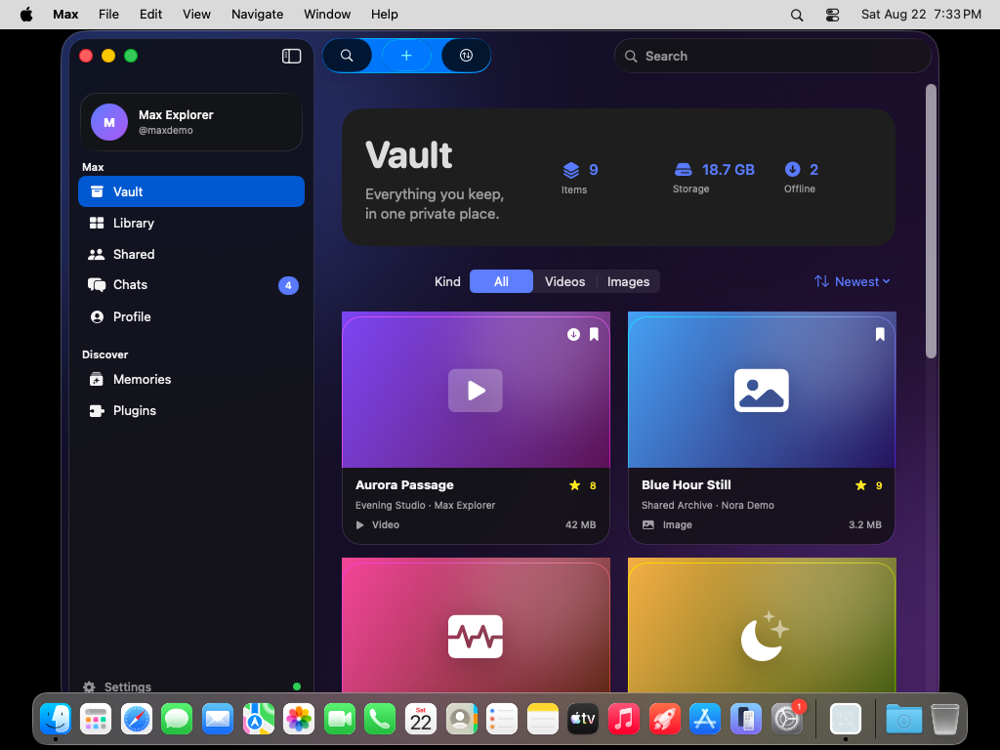

# Max macOS 26 — CI screenshot gallery

These 36 PNGs were captured by `XCUIScreenshot` from the running native SwiftUI
application in [GitHub Actions run 32593863848](https://github.com/justpainful/Maxishere2.0/actions/runs/32593863848).
The run used macOS 26.5.2 on arm64 with Xcode 26.6 and Swift 6.3.3. The downloadable
artifact on that run also contains the Release `.app` zip, its SHA-256, full
build/test logs, and the `.xcresult` bundle.

## Core experience

| Vault | Native Liquid Glass player |
| --- | --- |
|  |  |

| Library | Shared spaces |
| --- | --- |
|  |  |

| Chats | Profile |
| --- | --- |
|  |  |

## Native Mac surfaces

| Command palette | Settings |
| --- | --- |
|  |  |

| Arabic RTL | Compact window |
| --- | --- |
|  |  |

## Complete capture set

- Authentication: `01-authentication-wide.png`, `02-authentication-credentials.png`
- Vault and media: `03-vault-wide.png`, `04-player-native-liquid-glass.png`, `05-dual-rating-editor.png`
- Transfers: `06-upload-sheet.png`, `07-transfer-manager.png`
- Library: `08-library-overview.png` and the five `09-library-*.png` captures
- Sharing: `10-shared-files.png`, `11-shared-spaces.png`, `12-workspace-detail.png`
- Chats: `13-chats-conversation.png`, `14-chat-details-panel.png`, `15-new-conversation.png`
- Profile and discovery: `16-profile.png` through `20-command-palette.png`
- Settings/themes: `21-settings-max.png`, all six `22-theme-*.png`, and `23-settings-arabic-rtl.png`
- Compact layouts: `24-vault-compact.png` through `27-profile-compact.png`

CI provenance is preserved in [`environment.txt`](environment.txt), and the
downloadable application zip checksum is recorded in
[`Max-macOS-26-Tahoe.zip.sha256`](Max-macOS-26-Tahoe.zip.sha256).
